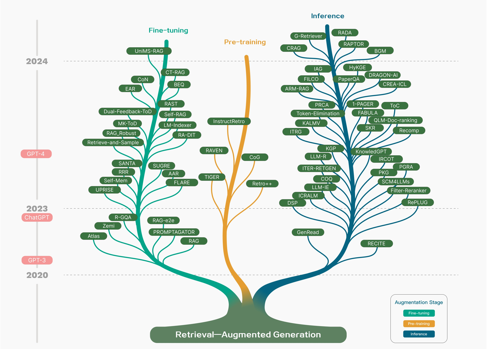

# Retrieval-augmented-generation-RAG-using-Gemini
Implementation Retrieval-augmented generation (RAG)  for Gemini API

## A. Background and Motivation
Large Language Models (LLMs) have shown impressive capabilities, but they still struggle with specific challenges like hallucination, outdated knowledge, and a lack of traceability in their reasoning. These issues become more prominent when dealing with knowledge-intensive or time-sensitive tasks. Retrieval-Augmented Generation (RAG) addresses these challenges by integrating real-time, up-to-date knowledge from external databases into the generation process. This allows LLMs to incorporate domain-specific, current, and verified information, making them more reliable and accurate in scenarios that require specialized knowledge.



The motivation behind this project is to leverage RAG for the Gemini API to enhance its ability to provide informed, accurate, and context-specific responses for various applications. Integrating external data with the API ensures better performance in tasks that involve complex knowledge retrieval and generation.

## B. Key Innovations
1. **Dynamic Knowledge Integration**: The system combines the inherent knowledge of LLMs with external data sources, allowing real-time updates and domain-specific information to be included in responses.
2. **Mitigating Hallucinations**: By retrieving verified content from databases, the model significantly reduces the occurrence of incorrect or hallucinated information.
3. **Modular RAG**: The architecture uses a flexible modular RAG system that allows different retrieval and augmentation strategies depending on the task's needs.
4. **Iterative Retrieval**: This process ensures that the retrieved context is refined and improved over multiple retrieval steps, providing more relevant content to generate better responses.
   
## C. Architecture of RAG
1. **Indexing**: Data is preprocessed, split into chunks, and stored in a vectorized database using embeddings. These chunks represent various information units.
2. **Retrieval**: When a query is made to the Gemini API, the system encodes the query and retrieves the most relevant chunks from the database based on semantic similarity.
3. **Generation**: The retrieved information is combined with the query, and a generation model (e.g., a large language model) produces an informed response.
4. **Post-Retrieval Augmentation**: The retrieved chunks are processed to ensure relevance and to eliminate noise, improving the final output's accuracy.
   
   The RAG process involves:
   - **Query Encoding**: The user’s query is encoded and compared with indexed chunks.
   - **Semantic Search**: Top-k results are retrieved based on their similarity to the query.
   - **Context Generation**: The retrieved chunks are used as context for generating a more accurate, relevant response.
   
   The architecture is designed to allow easy scaling and adaptation to various downstream tasks.

## D. Database Using MySQL
MySQL is used as the underlying database to store and manage structured data in this RAG implementation. Here’s how the database setup integrates with RAG:
1. **Data Storage**: MySQL stores structured data (e.g., metadata, document links) which is queried during the retrieval process.
2. **Integration**: When a query requires specific, structured information (like statistical data, product specifications, etc.), MySQL efficiently retrieves it and hands it to the augmentation module.
3. **Optimizations**: For efficient query processing, MySQL employs indexing and caching techniques, ensuring quick response times even with large datasets.

# Streamlit implementation
Here is a link to the RAG implementation on Streamlit : 

```
https://rag-zein.streamlit.app/
```